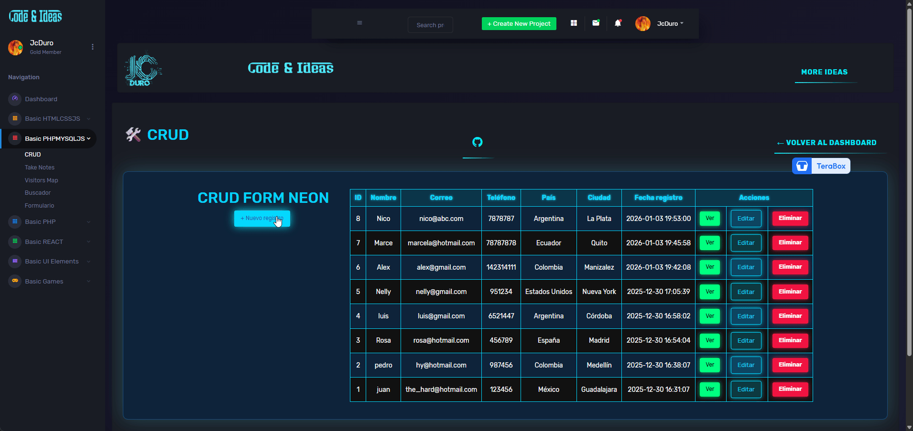

# ✨ Form Neon CRUD – JcDuro Dashboard

Pequeño módulo **CRUD** desarrollado en PHP con PDO y MySQL para gestionar registros de contacto (nombre, correo, teléfono, país y ciudad) desde una interfaz con estilo azul neón integrada al JcDuro Dashboard.

## 📚 Índice

- [Descripción](#-descripción)
- [Características](#-características)
- [Tecnologías](#-tecnologías)
- [Estructura del proyecto](#-estructura-del-proyecto)
- [Base de datos](#-base-de-datos)
- [Instalación](#-instalación)
- [Uso](#-uso)


---

## 🖼️ Vista previa



--- 

## 🚀 Demo
[Crud](https://jcduro.bexartideas.com/proyectos/dashjc/crud/crud.php)

--- 

## 📊 Lenguajes y Herramientas

[](https://skillicons.dev)

--- 

## 📝 Descripción

Form Neon es un CRUD construido con PHP + PDO y MySQL para administrar registros de usuarios
(nombre, correo, teléfono, país y ciudad) desde un panel web con estética neón, como parte del
ecosistema JcDuro Dashboard.

El objetivo es ofrecer un ejemplo limpio y reutilizable de CRUD (Create, Read, Update, Delete)
que pueda integrarse fácilmente en otros módulos del dashboard o proyectos similares.[web:74][web:81]

--- 

## 🛠 Características

- CRUD completo sobre la tabla `form_neon` (crear, listar, ver detalle, actualizar y eliminar).
- Interfaz con botones de acciones en verde, azul y rojo neón para Ver, Editar y Eliminar.
- Modal de confirmación para la eliminación de registros, evitando borrados accidentales.[web:63][web:69]
- Validación básica del formulario (campos obligatorios en alta y edición).
- Integración con plantillas globales del dashboard (`header`, `menu`, `footer`).
- Código organizado por responsabilidades: conexión, listado, create, read, update y delete.

--- 

## 💻 Tecnologías

- PHP 7+ con PDO para la capa de acceso a datos.
- MySQL / MariaDB como motor de base de datos.
- HTML5 y CSS3 para el layout y estilos neón personalizados.
- JavaScript vanilla para controlar el modal de confirmación de borrado.
- Plantillas propias del JcDuro Dashboard para la estructura general del layout.[web:73][web:77]

--- 

## 🗂 Estructura del proyecto

```bash
proyectos/dashjc/crud/
├── db.php           # Conexión PDO a MySQL
├── crud.php         # Listado principal de registros + acciones
├── create.php       # Alta de nuevos registros
├── read.php         # Vista de detalle
├── update.php       # Edición de registros
├── delete.php       # Eliminación de registros
└── (CSS/JS compartidos en plantillas globales del dashboard)
```

---

## Base de datos y preview


## 💽 Base de datos

El proyecto utiliza una tabla llamada `form_neon` con la siguiente estructura:

```sql
CREATE TABLE `form_neon` (
  `id` int(11) NOT NULL,
  `nombre` varchar(100) NOT NULL,
  `correo` varchar(255) NOT NULL,
  `telefono` varchar(50) NOT NULL,
  `pais` varchar(100) NOT NULL,
  `ciudad` varchar(100) NOT NULL,
  `fecha_registro` datetime DEFAULT current_timestamp()
) ENGINE=InnoDB DEFAULT CHARSET=utf8mb4 COLLATE=utf8mb4_unicode_ci;
```

---

## 🚀 Instalación

1. Clonar o descargar este repositorio.
2. Crear la base de datos e importar la tabla `form_neon` con el script SQL anterior.
3. Configurar las credenciales en `db.php`:

   ```text
   $DB_HOST = 'localhost';
   $DB_NAME = 'form_neon';
   $DB_USER = 'tu_usuario';
   $DB_PASS = 'tu_password';


Integrar la carpeta crud dentro de tu JcDuro Dashboard (o ajustar rutas de header.php, menu.php, footer.php).

Acceder a crud.php desde el navegador o enlazarlo desde el menú principal del dashboard.[web:73][web:77]

---

## 🧩 Uso

Crear: botón + Nuevo registro → formulario en create.php para alta de datos.

Leer: enlace Ver (verde neón) para ver el detalle del registro en read.php.

Actualizar: enlace Editar (azul neón) para modificar campos en update.php.

Eliminar: botón Eliminar (rojo neón) abre un modal de confirmación antes de llamar a delete.php.[web:73][web:81]

---

## 📌 To‑Do

Validación avanzada (formato de correo, longitud de campos, etc.).

Paginación y filtros en el listado (por nombre, correo, país o ciudad).

Mensajes flash de éxito/error centralizados en las plantillas globales.

Internacionalización de textos (ES/EN) y mejoras de accesibilidad.


